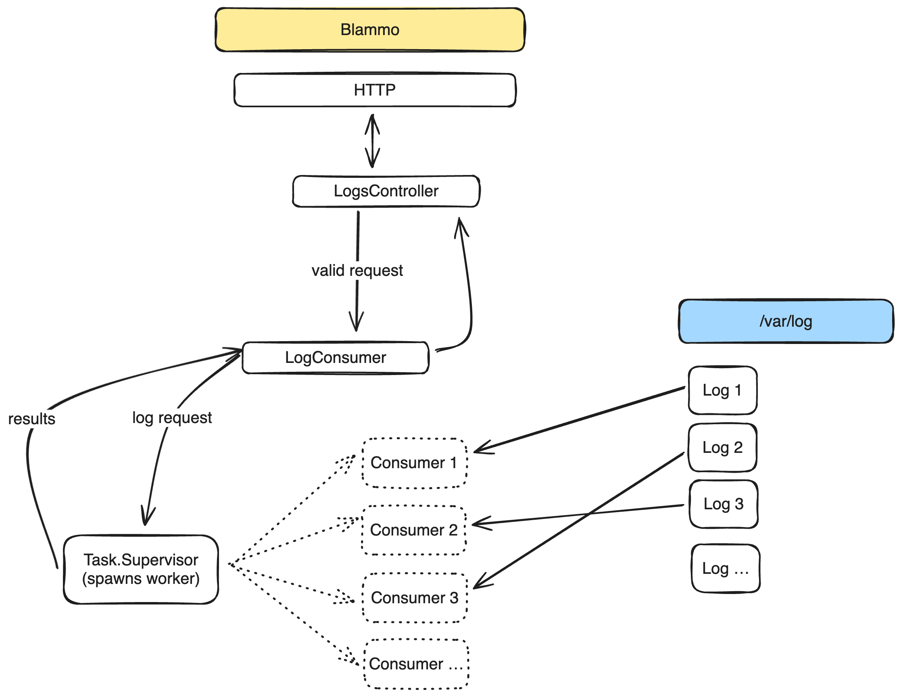

# Blammo Design

We have a couple of high level concepts here

- the HTTP server providing the REST API
- the capability to gather logs

The HTTP server is a typical HTTP server, no unusual requirements here. We have to expose a REST API, reject invalid requests, accept valid requests, provide responses.

The capability to gather log lines is a little more interesting. We could largely ignore this concept and simply do calls to the filesystem from every HTTP request. We could even shell out to command line tools like `tail` and `grep` but it might be more interesting to expand this concept.

Expanding on the capability to gather log lines we could cache recently requested log lines, actively maintain caches of all recently written log files, aggregate observations, etc.

As a starting point I think we don't need to create an entirely separate client process that handles log file access. But we can make it a named and structured concept in the REST server. Taking that approach we should be careful both not to leak REST API concepts into the log reader and not to leak log file reading concepts into the REST API.

If we lean more into unblocking requests than we can get into some interesting architecture such as introducing a durable log to hold the actual log file contents. Populating the durable log as log files are written and only serving HTTP responses from the durable log data.

## Blammo Domain Concepts

Blammo currently has these three major domains

- HTTP API (routing, controllers, etc)
- Log Consumer: handles requesting a task which calls Blammo.File and presenting lines or an error value to the HTTP API
- Blammo.File: provides functions that accept a filepath and filtering arguments and return a list of lines fulfilling the request

## High Level Design



## Security

Of utmost concern is that we are allowing users to specify files on the filesystem. If we aren't careful we could inadvertently expose system files. Of course Blammo is careful and there are automated tests around that edge.

## Choices to Consider

### Reading lines from the end of a file

The `Blammo.File` module's reading from the end of a file could be optimized. Currently we read a starting chunk from the end of the file, split that chunk by newlines, discard the first line (almost certainly a partial line) unless we've reached the beginning of the file, and then count the lines.

- If we've reached the beginning of the file: return whatever lines we have gotten.
- If our count matches our requested limit: we're done!
- If our count is less than our limit: try again with a doubled chunk size.

This approach is simple, performant, avoids memory issues, avoids any mechanics around position tracking and assembling lines. These are all nice qualities to have: but we should prioritize some experimentation to compare this approach with one that reads progressively more of the file instead of progressively larger chunks from the end of the file.

It could well be that the overhead of tracking lines between function calls, joining lists, and ensuring we don't stumble on partial lines isn't worth the effort. But it should be measured.

One consideration that would absolutely make the effort worthwhile is if we want to filter first and allow finding sparse results. Instead of an increasing chunk size until we have enough lines to return we'll need to be able to efficiently step backwards through the file in pieces; filtering as we go.

It could also well be that any effort on this aspect of the domain is better spent writing a lower level utility for handling file reads, e.g. writing a NIF in Rust.

### Chunk size

Currently the chunk size we start with is fixed at `65536`. We could introduce a process into the application stack that is asynchronously called with the maximum chunk size needed to satisfy each request. That process could maintain statistical aggregates and provide an optimal chunk size to subsequent requests. That would allow this application to dynamically improve its performance if it finds that it's doing small reads or big reads.

For example if we find that the chunk size almost never needs to increase then it could start providing `32768` or some other smaller starting point. If we find that the chunk size almost always needs to increase then it could start providing the statistical mode of the needed chunk sizes.

### Filter and then get lines OR Get lines and then filter

Currently Blammo provides functions for either approach. If we have a product decision on how we should tail/filter log files then we may be able to delete a path of code.

If we actually do want to provide both approaches then there is an opportunity to refactor the code paths in `Blammo.LogConsumer` which are largely duplicated at present.

### User selection of files

Currently Blammo allows the user to specify any arbitrary file and, if found in the log path, it will be returned.

An alternative approach would be to have a well known list of allowed log files the user must select. Or possibly to only allow selecting \*.log files.

### Web Interface

Currently the web interface does not get to create or even have access to the spawned Task that gathers log data. It would be an improvement to change the live view to have the task available. Then we could grey out the lines or put up a spinner while the work is happening in the background and populate the contents when the task is complete. Right now our live view simply waits for data which is fine enough when the results are fast but for slow results more user feedback would be nice.

## Performance

Currently Blammo maintains stable memory usage, allows a high number of concurrent requests, and is performant up to reasonable line counts.

e.g.

### filter first

```
hey http://localhost:4000/api/logs/filter-first\?filename\=sample.1GB.log\&lines\=1000\&filter\=xyzzy

Summary:
  Total:    0.2752 secs
  Slowest:  0.0859 secs
  Fastest:  0.0366 secs
  Average:  0.0637 secs
  Requests/sec: 726.6398


Response time histogram:
  0.037 [1]   |■
  0.042 [1]   |■
  0.046 [6]   |■■■■■
  0.051 [13]  |■■■■■■■■■■
  0.056 [21]  |■■■■■■■■■■■■■■■■■
  0.061 [30]  |■■■■■■■■■■■■■■■■■■■■■■■■
  0.066 [50]  |■■■■■■■■■■■■■■■■■■■■■■■■■■■■■■■■■■■■■■■■
  0.071 [35]  |■■■■■■■■■■■■■■■■■■■■■■■■■■■■
  0.076 [23]  |■■■■■■■■■■■■■■■■■■
  0.081 [8]   |■■■■■■
  0.086 [12]  |■■■■■■■■■■


Latency distribution:
  10% in 0.0507 secs
  25% in 0.0581 secs
  50% in 0.0641 secs
  75% in 0.0692 secs
  90% in 0.0762 secs
  95% in 0.0825 secs
  99% in 0.0859 secs

Details (average, fastest, slowest):
  DNS+dialup:	0.0010 secs, 0.0366 secs, 0.0859 secs
  DNS-lookup:	0.0006 secs, 0.0000 secs, 0.0026 secs
  req write:	0.0001 secs, 0.0000 secs, 0.0017 secs
  resp wait:	0.0619 secs, 0.0364 secs, 0.0857 secs
  resp read:	0.0006 secs, 0.0002 secs, 0.0045 secs

Status code distribution:
  [200]	200 responses
```

### tail first

```
hey http://localhost:4000/api/logs/tail-first\?filename\=sample.1GB.log\&lines\=1000\&filter\=xyzzy

Summary:
  Total:    0.0948 secs
  Slowest:  0.0346 secs
  Fastest:  0.0119 secs
  Average:  0.0222 secs
  Requests/sec: 2108.7528


Response time histogram:
  0.012 [1]   |■
  0.014 [11]  |■■■■■■■■■■
  0.016 [15]  |■■■■■■■■■■■■■■
  0.019 [27]  |■■■■■■■■■■■■■■■■■■■■■■■■■
  0.021 [43]  |■■■■■■■■■■■■■■■■■■■■■■■■■■■■■■■■■■■■■■■■
  0.023 [28]  |■■■■■■■■■■■■■■■■■■■■■■■■■■
  0.026 [22]  |■■■■■■■■■■■■■■■■■■■■
  0.028 [13]  |■■■■■■■■■■■■
  0.030 [9]   |■■■■■■■■
  0.032 [19]  |■■■■■■■■■■■■■■■■■■
  0.035 [12]  |■■■■■■■■■■■


Latency distribution:
  10% in 0.0156 secs
  25% in 0.0186 secs
  50% in 0.0213 secs
  75% in 0.0263 secs
  90% in 0.0307 secs
  95% in 0.0326 secs
  99% in 0.0332 secs

Details (average, fastest, slowest):
  DNS+dialup:	0.0009 secs, 0.0119 secs, 0.0346 secs
  DNS-lookup:	0.0005 secs, 0.0000 secs, 0.0021 secs
  req write:	0.0000 secs, 0.0000 secs, 0.0004 secs
  resp wait:	0.0211 secs, 0.0090 secs, 0.0293 secs
  resp read:	0.0002 secs, 0.0000 secs, 0.0015 secs

Status code distribution:
  [200]	200 responses
```
