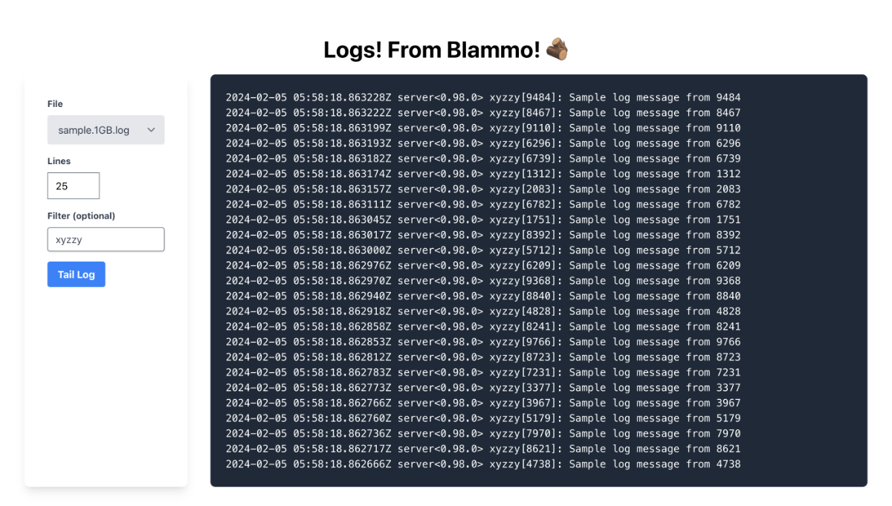

# Blammo

Let's get log contents via REST!

"It's LOG from Blammo!"




## Usage

You can either use the web interface at http://localhost:4000 or access the API directly.

When tailing logs you have the choice of two approaches

- one applies a given filter (if any) first and searches until it reaches the requested number of lines, the beginning of the file, or times out
- one retrieves the requested number of lines first and then applies a given filter (if any)

| Endpoint                    | Route                              | Params                          |
| --------------------------- | ---------------------------------- | ------------------------------- |
| list logs                   | GET /api/logs                      | -                               |
| filter first                | GET /api/logs/filter-first         | filename, filter, lines         |
| lines first                 | GET /api/logs/tail-first           | filename, filter, lines         |
| list peer servers           | GET /api/servers                   | -                               |
| list logs on server         | GET /api/servers/logs              | server                          |
| filter first for server log | GET /api/servers/logs/filter-first | server, filename, filter, lines |
| tail first for server log   | GET /api/servers/logs/tail-first   | server, filename, filter, lines |

The `lines` parameter defaults to `1000` if not provided.

Examples:

```bash
# fetch 1000 most recent lines from sample.10MB.log
curl http://localhost:4000/api/logs/tail-first\?filename\=sample.10MB.log

# fetch 250 most recent lines containing "xyzzy"
curl http://localhost:4000/api/logs/filter-first\?filename\=sample.10MB.log\&filter=xyzzy\&lines=250

# fetch 250 most recent lines and then filter that set to lines with "plugh"
curl http://localhost:4000/api/logs/tail-first\?filename\=sample.10MB.log\&filter=xyzzy\&lines=250
```

## Goals

Provide log file contents via REST

- Lines from the log file will be returned newest–oldest
  - Assume log files will have the newest lines at the end of the file
- Provide contents via REST
  - arguments
    - filename
    - (optional) N lines
    - (optional) text filtering
- Be performant for files >1GB in size

### Stretch Goals

- A basic UI (beyond a curl text API)
- A primary server that requests logs from secondary servers
  - protocol between primary–secondary does not have to be REST

## Running Blammo

- Have Elixir installed: I recommend using [mise](https://mise.jdx.dev/)

```
mise plugin add erlang https://github.com/asdf-vm/asdf-erlang.git
```

```
mise plugin install elixir https://github.com/glossia/mise-elixir.git
```

```
mise install elixir
```

- clone this repo
- cd into the repo directory
- Run `mix setup` to install and setup dependencies
- Run `mix gen.sample_logs --log-size 10MB` to generate a small sample log
- Run `mix phx.server` to run the HTTP server

With the server running you can query the API for log lines! (The development server automatically reads from the sample_logs directory)

```
# last 12 lines of the log file
curl http://localhost:4000/api/logs\?filename\=sample.10MB.log\&lines\=12

# last 12 instances of xyzzy
curl http://localhost:4000/api/logs\?filename\=sample.10MB.log\&lines\=12\&filter=xyzzy
```

You can also browse to the web interface!

http://localhost:4000/

It's log log log!

## Running multiple instances

If you name your Blammo nodes in the pattern `node<1-4>@localhost` then the nodes will
automatically cluster and allow reading log files from any peer.

e.g.

```
node1@localhost
node2@localhost
```

To name a node use Elixir's standard node naming

```
iex --sname node1@localhost -S mix phx.server
```

```
iex --sname node2@localhost -S mix phx.server
```

## Running Tests

You can run all tests with the command

```
mix test
```

A test log file will be automatically created as needed.
