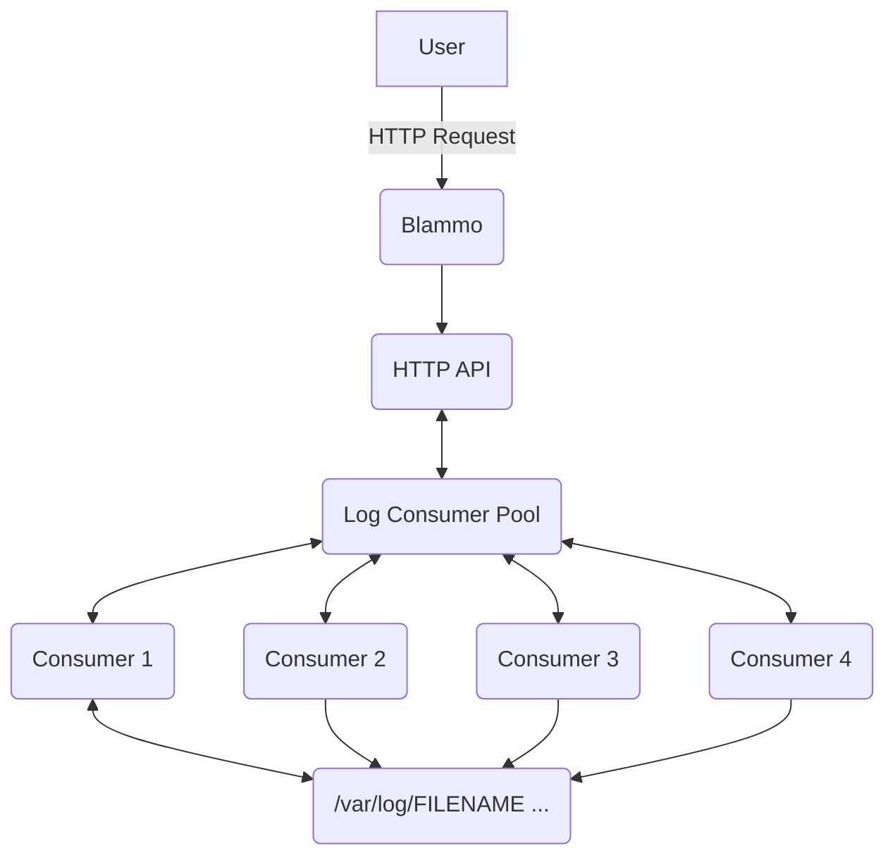

# Blammo

Let's get log contents via REST!

"It's LOG from Blammo!"

## Goal

Provide log file contents via REST

- Assume all logs are within `/var/log`: users can only specify the **filename** and not the full path
- Lines from the log file will be returned newest–oldest
  - Assume log files will have the newest lines at the end of the file
- Provide contents via REST
  - arguments
    - filename
    - (optional) N lines
    - (optional) text filtering
- Check performance against files >1GB in size

## Possible

- A basic UI
- A primary server that requests logs from secondary servers
  - protocol between primary–secondary does not have to be REST

## Design

We have a couple of concepts here

- the HTTP server providing the REST API
- the capability to gather logs

The HTTP server is a typical HTTP server, no unusual requirements here. We have to expose a REST API, reject invalid requests, accept valid requests, provide responses.

The capability to gather log lines is a little more interesting. We could largely ignore this concept and simply do calls to the filesystem from every HTTP request. We could even shell out to command line tools like `tail` and `grep` but it might be more interesting to expand this concept.

Expanding on the capability to gather log lines we could cache recently requested log lines, actively maintain caches of all recently written log files, aggregate observations, etc.

As a starting point I think we don't need to create an entirely separate client process that handles log file access. But we can make it a named and structured concept in the REST server. Taking that approach we should be careful both not to leak REST API concepts into the log reader and not to leak log file reading concepts into the REST API.

We could run a pool of reader processes to ensure HTTP requests are minimally blocked by filesystem IO.

If we lean more into unblocking requests than we can get into some interesting architecture such as introducing a durable log to hold the actual log file contents. Populating the durable log as log files are written and only serving HTTP responses from the durable log data.

Let's start with an HTTP Server, Log Consumer Pool, and Log Consumer processes.

## Running the server

- Run `mix setup` to install and setup dependencies
- Run `mix phx.server` to run the HTTP server

Now you can visit [`localhost:4000`](http://localhost:4000) from your browser.
